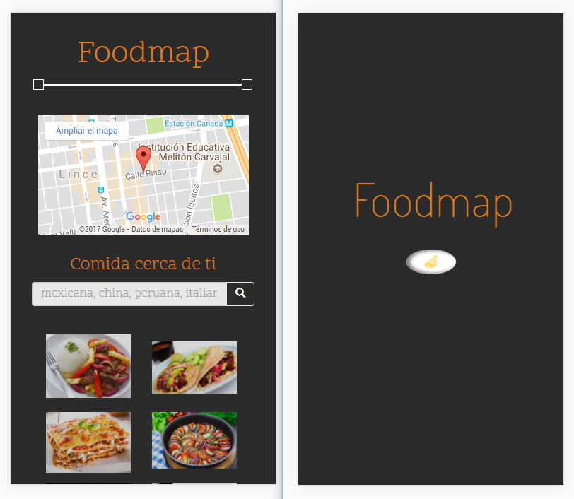

# Foodmap - movil

***
## Se utilizó

`HTML`   `CSS` `Framework Bootstrap` 'jQuery'

## Descripción

Se trata de realizar un buscador de lugares para comer donde se filtra por
tipo de comida (todo, china, mexicana, italiana y peruana) mostrando los
resultados. Todo principalmente mediante jQuery.

## Trabajo terminado

## Especificaciones

* Esta web utilizó la tipografía: `Dosis`, `Quattrocento Sans`.
* Otros íconos pertenecen a Bootstrap - Glyphicons.

`Nota:`

*Este trabajo se ha subido a gh-pages [aquí](https://yaniraab.github.io/foodmap-movil/).
