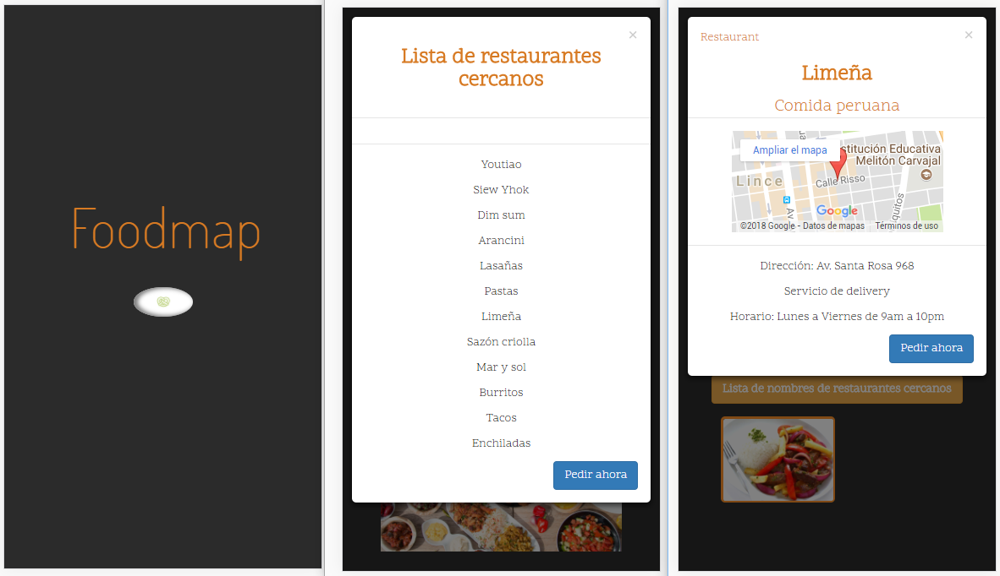

# Foodmap - movil

***
## Se utilizó

`HTML`   `CSS` `Framework Bootstrap` `jQuery`

## Descripción

Se trata de realizar un buscador de lugares para comer donde se filtra por
el nombre del Restaurante (Lineña, Tacos, Burritos, Pastas, etc) mostrando los
resultados y luego dandole click en la imagen del restaurante aparece un modal
con la información (dirección, horario, delivery,etc). Todo principalmente
mediante jQuery.

El EVENTO `mousover()` se aplicó a la imágen principal que aparece antes de la búsqueda,
 si el mouse se posa encima de la imagen aparece una alerta avisando que de click
  en el botón amarillo para ver la lista de restaurantes cercanos.

En la página principal se muestra el input y debajo un botón donde contiene la lista
de Restaurantes cercanos al usuario. Al dar click en el boton puede obtener los
nombres de los restaurantes para poder buscarlos ingresándolos en el input.

## Trabajo terminado

## Especificaciones

* Esta web utilizó la tipografía: `Dosis`, `Quattrocento Sans`.
* Otros íconos pertenecen a Bootstrap - Glyphicons.

`Nota:`

*Este trabajo se ha subido a gh-pages [aquí](https://yaniraab.github.io/foodmap-movil/).
